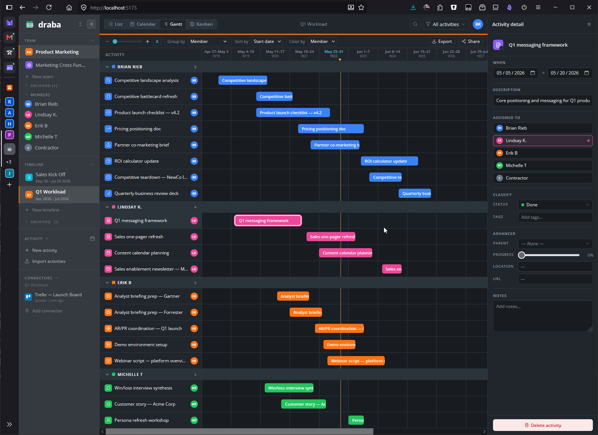

# draba

> **Who is working on what, and when?**



**draba** is a lightweight team coordination and planning tool designed specifically for small teams (5–20 people) who need high-level visibility across people and time. 

---

## What draba is NOT

The market is oversaturated with heavy, expensive, and overly complicated work management platforms. draba was built by explicitly rejecting those models. 

* **Not a project management tool:** We don't do sprints, story points, or complex ticket dependencies.
* **Not a task app or time tracker:** We don't want you tracking hourly tasks, filling out time cards, or micromanaging your day. 
* **Not an "ecosystem":** draba doesn't want to be the app you live in. Get in, see the plan, update your timeline, and get back to actual work.  

## What draba IS

Instead of replacing your calendar or forcing you into a heavy workflow, draba focuses on one thing and does it well: **a shared team timeline**.

* **Horizontal, Person-First Timeline:** See exactly what high-level initiatives every team member is tackling at a glance.
* **Frictionless Sharing:** Use draba for internal planning, and easily generate a stable link to share specific views outside of your team. 
* **Real-Time Collaboration:** Multiple users can view and edit the board simultaneously, with changes broadcasting instantly without refreshing.
* **Calendar Sync (Coming Soon):** We are building a two-way sync with Google Calendar and a built-in CalDAV server so native apps (like Apple Calendar) can connect directly to your draba timeline.

---

## Technology Stack

draba is built as a fast, zero-config, API-first, and event-driven application. 

| Component | Technology |
| :--- | :--- |
| **Backend** | Go (API + built-in CalDAV server) |
| **Frontend** | React 19, TypeScript, Vite, and Tailwind CSS v4 |
| **Database** | Switchable: SQLite, PostgreSQL, and MySQL/MariaDB compatible (coming soon) via `sqlx` |
| **Real-Time** | WebSockets for team-scoped broadcasting |
| **API Contract** | OpenAPI with auto-generated TypeScript types |

---

## Deployment (Self-Hosted)

draba is built for zero-friction self-hosting. It runs entirely as a single Docker container with an embedded SQLite database by default, meaning no external services or complex setups are required.

You can pull the official image directly from Docker Hub:

```bash
docker pull mewcus/draba
```

## Status

draba is currently under active development. The core backend API foundation (authentication, teams, events, websockets) is complete, and active development is focused on building out the React frontend.

Check out the `docs/` folder for our architecture decisions, roadmap, and design patterns.